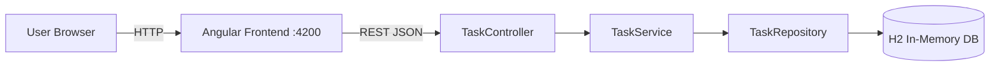
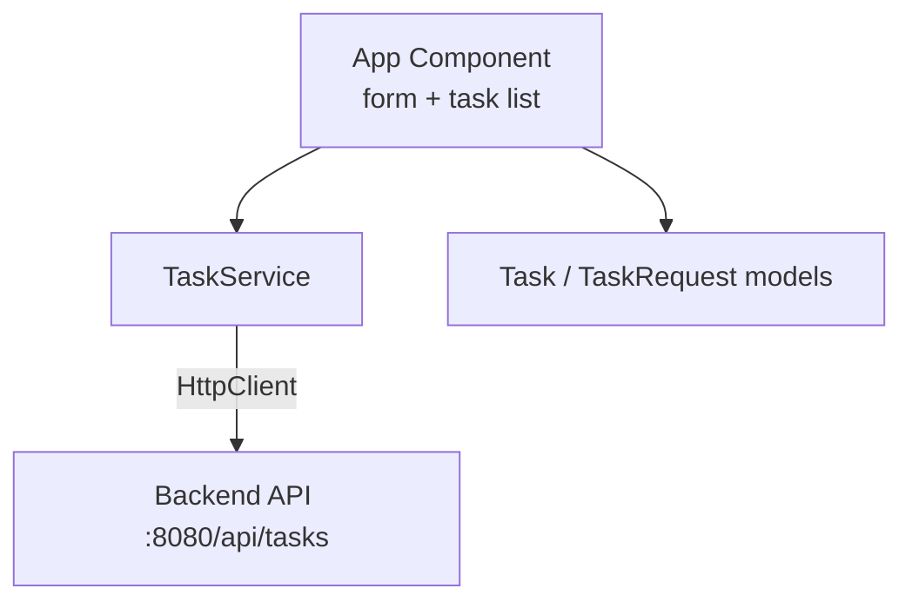

# Simple Task Manager

A small full-stack task manager: create tasks via an Angular form and persist them through a Spring Boot REST API into an H2 in-memory database.

## Tech Stack

- **Frontend:** Angular 22 (standalone components, reactive forms)
- **Backend:** Java 21, Spring Boot 4, Spring Data JPA/Hibernate, Bean Validation
- **Database:** H2 (in-memory)

## Project Structure

```
task-manager/
├── frontend/   # Angular application
├── backend/    # Spring Boot application
└── README.md
```

## Architecture



**Backend layering (SOLID / separation of concerns):**

```mermaid
flowchart TD
    Controller[Controller Layer\nHTTP, validation entrypoint] --> Service[Service Layer\nbusiness logic, mapping]
    Service --> Repository[Repository Layer\nSpring Data JPA]
    Repository --> H2[(H2 Database)]
    DTO[DTOs\nTaskRequest / TaskResponse] -.-> Controller
    DTO -.-> Service
    Advice[GlobalExceptionHandler\n@RestControllerAdvice] -.-> Controller
```

**Frontend structure:**



## API Endpoints

| Method | Path         | Description                    |
|--------|--------------|--------------------------------|
| POST   | /api/tasks   | Create a task (JSON body)      |
| GET    | /api/tasks   | List all tasks                 |

**POST body example:**
```json
{ "title": "Buy milk", "description": "2 liters, whole milk" }
```

## How to Run

### Backend (port 8080)

```powershell
cd backend
.\mvnw.cmd spring-boot:run
```

H2 console: http://localhost:8080/h2-console (JDBC URL: `jdbc:h2:mem:taskdb`, user `sa`, no password)

### Frontend (port 4200)

```powershell
cd frontend
npm install   # if needed
ng serve
```

Open http://localhost:4200

## Validation & Error Handling

- Backend: `title` is required (`@NotBlank`); violations return HTTP 400 with a JSON error map. Handled globally by `GlobalExceptionHandler`.
- Frontend: form validates required title; API errors are shown as messages; success feedback shown after creation.

## Notes / Possible Improvements

- Add pagination, edit/delete endpoints, and task completion status.
- Add integration tests (`@WebMvcTest`, Testcontainers).
- Replace in-memory H2 with a persistent DB for production.
